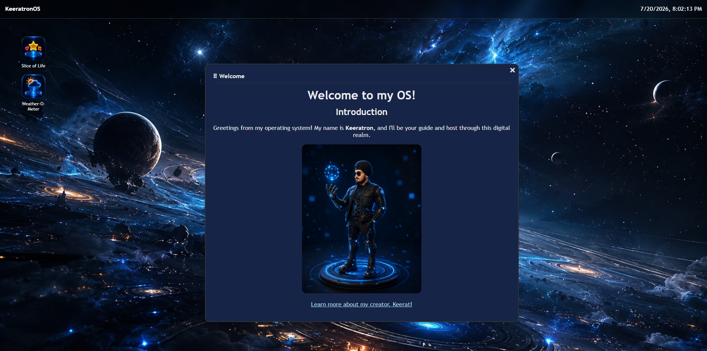

# KeeratronOS

A personal web-based operating system (OS) built for the Hack Club Stardance Challenge ("Make Your Own WebOS" batch). It that lives entirely in the browser, hosted by **Keeratron**, a fictional AI-guide version of me!

🔗 **Live demo:** [(https://personal-os-sage-five.vercel.app/)]

## About

KeeratronOS is a different kind of personal portofolio site. It works as a fully interactive desktop OS, similar to Windows or Linux :P

## Features

- **Draggable, closable windows** with  z-index stacking (click a window, it comes to front)
- **Desktop app icons** with click-to-select highlighting
- **Live clock** in the top bar

### Apps

- **Welcome**: an intro to Keeratron and the OS
- **Slice of Life**: a categorized catalog of my favorite foods, hobbies, and entertainment, with a clickable sidebar
- **Weather-O-Meter**: live weather lookup for any city, with real-time search suggestions.

But please, try them out! Don't just let me tell you!!

## Built With

- HTML
- CSS
- JavaScript

## Credits

Built by [Keerat](https://github.com/codingwithdaas) as part of Hack Club's Stardance Challenge — ["Make Your Own WebOS" batch](https://jams.hackclub.com/batch/webOS).

The windowing system (draggable windows, open/close, z-index stacking, desktop icons) was built by following the official WebOS Jam tutorials by [SerenityUX](https://github.com/SerenityUX):
[Part 1–5: Make Your Own WebOS](https://jams.hackclub.com/batch/webOS)

All photos (wallpaper, app icons, etc.), and the Keeratron artwork were generated by ChatGPT.

Weather data provided by [Open-Meteo](https://open-meteo.com/)